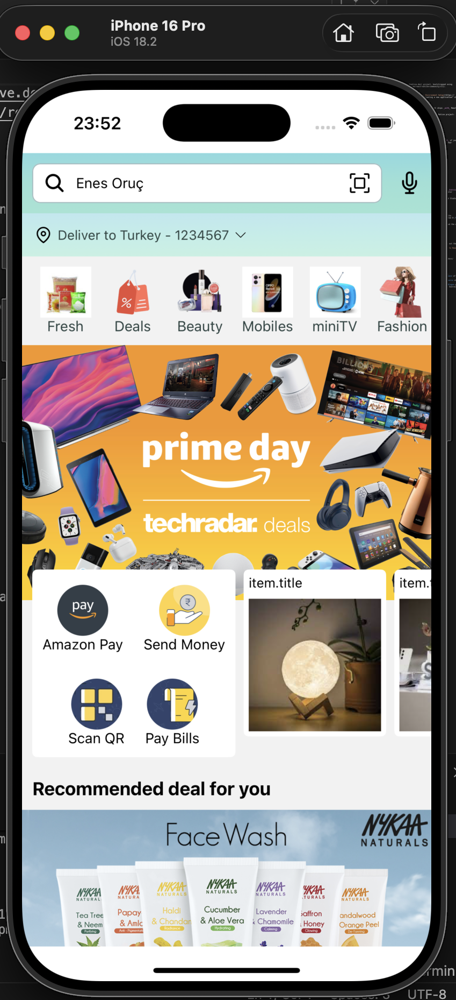

# Amazon Clone App - React Native

React Native ile geliştirilmiş modern ve özellik açısından zengin bir e-ticaret mobil uygulaması. Bu proje Amazon'un ana özelliklerini taklit ederek profesyonel mobil uygulama geliştirme uygulamalarını temiz bir mimarileme ve yeniden kullanılabilir bileşenlerle göstermektedir.

## 📱 Proje Hakkında

**Amazon Clone App**, işlevsel bir e-ticaret deneyimini sergileyen çapraz platform React Native uygulamasıdır. Uygulama ürün taraması, carousel navigasyonu, kategori filtrelemesi, indirim yönetimi ve kapsamlı arama işlevselliğine sahiptir.

### Ana Özellikler
- 🛍️ Ürün tarama ve gösterim
- 🎠 Swiper işlevselliğine sahip dinamik carousel
- 🏷️ Kategoriye dayalı ürün filtrelemesi
- 💰 Özel indirimler bölümü
- 🔍 Son aramalar ile arama işlevselliği
- 📱 iOS ve Android için duyarlı tasarım
- 🎨 Doğrusal gradyan UI bileşenleri
- 🗺️ Stack tabanlı navigasyon

## 🛠️ Teknolojiler ve Bağımlılıklar

### Temel Teknolojiler
- **React Native** `0.74.3` - Çapraz platform mobil framework
- **React** `18.2.0` - UI kütüphanesi
- **TypeScript** `5.0.4` - Tip güvenli JavaScript (isteğe bağlı)
- **Babel** `7.20.0` - JavaScript transpiler
- **Metro Bundler** - React Native için JavaScript bundler

### Navigasyon ve UI Kütüphaneleri
- **@react-navigation/native** `6.1.17` - Navigasyon framework'ü
- **@react-navigation/stack** `6.4.0` - Stack navigator
- **react-native-gesture-handler** `2.17.1` - Hareket tanıma
- **react-native-screens** `3.32.0` - Yerel ekran bileşeni
- **react-native-safe-area-context** `4.10.8` - Güvenli alan işleme
- **@react-native-masked-view/masked-view** `0.3.1` - Maskelü görünüm bileşeni

### UI Bileşenleri ve Efektler
- **react-native-linear-gradient** `2.8.3` - Gradyan arka planları
- **react-native-swiper** `1.6.0` - Carousel/swiper bileşeni
- **react-native-vector-icons** `10.1.0` - İkon kütüphanesi

### Geliştirme ve Test
- **Jest** `29.6.3` - Test framework'ü
- **ESLint** `8.19.0` - Kod linting
- **Prettier** `2.8.8` - Kod biçimlendirmesi

## 📁 Proje Yapısı

```
amazon_clone_rn/
├── src/
│   ├── assets/               # Statik varlıklar (görseller, yazı tipleri)
│   ├── components/           # Yeniden kullanılabilir UI bileşenleri
│   │   ├── Header.jsx       # Uygulama başlığı
│   │   ├── SubHeader.jsx    # İkincil başlık
│   │   ├── Carousel.jsx     # Resim carousel'ı
│   │   ├── Category.jsx     # Kategori seçici
│   │   ├── Brands.jsx       # Marka vitrin
│   │   ├── Deals.jsx        # Özel indirimler bölümü
│   │   ├── Services.jsx     # Hizmetler bölümü
│   │   └── ServicesCard.jsx # Hizmet kartı bileşeni
│   ├── screens/             # Uygulama ekranları
│   │   ├── HomeScreen.jsx   # Ana anasayfa
│   │   └── ProductScreen.jsx # Ürün detay ekranı
│   ├── navigation/          # Navigasyon yapılandırması
│   │   └── Router.jsx       # Stack navigator kurulumu
│   ├── data/                # Statik veri dosyaları
│   │   ├── CarouselData.js  # Carousel görselleri
│   │   ├── Categories.js    # Kategori verileri
│   │   ├── ProductData.js   # Ürün bilgileri
│   │   └── RecentSearchData.js # Son aramalar
│   └── utils/               # Yardımcı işlevler
│       └── helpers.js       # Yardımcı fonksiyonlar
├── ios/                      # iOS yerel kodu
├── android/                  # Android yerel kodu
├── App.jsx                   # Kök bileşeni
├── index.js                  # Giriş noktası
├── package.json              # Proje bağımlılıkları
├── babel.config.js           # Babel yapılandırması
├── metro.config.js           # Metro bundler yapılandırması
├── jest.config.js            # Jest test yapılandırması
└── tsconfig.json             # TypeScript yapılandırması
```

## 🚀 Başlarken

### Ön Koşullar
- Node.js >= 18
- npm veya yarn
- Xcode (iOS geliştirmesi için)
- Android Studio (Android geliştirmesi için)

### Kurulum

1. **Projeyi klonlayın**
```bash
git clone <repository-url>
cd amazon_clone_rn
```

2. **Bağımlılıkları yükleyin**
```bash
npm install
```

3. **iOS podlarını yükleyin**
```bash
cd ios
pod install
cd ..
```

### Uygulamayı Çalıştırma

#### Metro Bundler'ı başlatın (gerekli)
```bash
npm start
```

#### iOS Simülatöründe Çalıştırın
```bash
npm run ios
```

Veya belirli bir simülatör ile:
```bash
react-native run-ios --simulator="iPhone 16 Pro"
```

#### Android Emülatöründe Çalıştırın
```bash
npm run android
```

## 🧪 Kullanılabilir Komutlar

| Komut | Açıklama |
|-------|----------|
| `npm start` | Metro bundler'ı başlat |
| `npm run ios` | iOS simülatöründe derle ve çalıştır |
| `npm run android` | Android emülatöründe derle ve çalıştır |
| `npm run lint` | ESLint ile kod stilini kontrol et |
| `npm test` | Jest test paketini çalıştır |

## 🎨 Bileşen Mimarisi

### Önemli Bileşenler
- **Header**: Uygulama başlığı ve marka kimliği
- **Carousel**: Sayfalandırmaya sahip kaydırılabilir resim kaydırıcı
- **Category**: Ürün kategorisi navigasyonu
- **Deals**: Sınırlı süreli teklifler bölümü
- **Services**: Ek hizmetler vitrin
- **Product Display**: Dinamik ürün listesi ve detayları

### Navigasyon Akışı
```
App Root
└── Router (Stack Navigator)
    ├── HomeScreen
    │   ├── Header
    │   ├── SubHeader
    │   ├── Carousel
    │   ├── Category
    │   ├── Brands
    │   ├── Deals
    │   └── Services
    └── ProductScreen
        └── Ürün Detayları
```

## 🔧 Yapılandırma

### Babel Yapılandırması
ES6+ transpoze için React Native ön seti ile yapılandırılmıştır.

### Metro Yapılandırması
Varlık işleme için özel yapılandırmaya sahip React Native Metro bundler'ı kullanır.

### TypeScript Desteği
Tip güvenli geliştirme için TypeScript yapılandırması dahildir (tsconfig.json).

## 📦 Üretim için Derle

### iOS
```bash
cd ios
xcodebuild -workspace RN_AmazonCloneApp.xcworkspace -scheme RN_AmazonCloneApp -configuration Release
```

### Android
```bash
cd android
./gradlew assembleRelease
```

## 🐛 Sorun Giderme

### iOS Derleme Sorunları
- Xcode'un güncellenmiş olduğundan emin olun: `xcode-select --install`
- Derleme önbelleğini temizleyin: `rm -rf ~/Library/Developer/Xcode/DerivedData`
- Pod'ları yeniden yükleyin: `cd ios && rm Podfile.lock && pod install`

### Android Derleme Sorunları
- Android SDK ve derleme araçlarını güncelleyin
- Gradle önbelleğini temizleyin: `./gradlew clean`

### Metro Bundler Sorunları
```bash
npm start -- --reset-cache
```
---

## 📸 Proje Önizlemesi




# amazone_clone_rn
